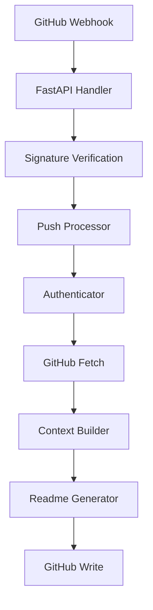

# Auto-README Bot

Generate or update a repository README.md automatically from a GitHub push using OpenAI. The service receives GitHub push webhooks, inspects the repo tree and changed files, builds a compact repo context, asks OpenAI to generate or update README.md, and opens or updates a pull request with the result.

Features
- Receives GitHub push webhooks and verifies signatures (see app/main.py and app/security.py).
- Skips non push events, pushes to non default branches, branch deletions, and commits that look like the bot's own (see app/main.py).
- Builds a token-budgeted repo context including selected key files and a truncated file tree (see app/context_builder.py).
- Calls OpenAI to generate the README from the repo context (see app/readme_generator.py).
- Writes README.md to a dedicated bot branch and opens or updates a PR (see app/github_api.py and app/main.py).
- Configurable behavior via environment variables (see app/config.py).

Requirements
Install Python dependencies from requirements.txt (contains fastapi, uvicorn, httpx, openai, PyJWT, tiktoken, python-dotenv, cryptography, etc.) — see requirements.txt.

Environment
Set the environment variables referenced in app/config.py:
- GITHUB_APP_ID (required)
- GITHUB_APP_PRIVATE_KEY or GITHUB_APP_PRIVATE_KEY_PATH (one required)
- GITHUB_WEBHOOK_SECRET (required for signature verification)
- OPENAI_API_KEY (required)
- Optional: OPENAI_MODEL (defaults to "gpt-5-mini" in app/config.py)

Notable defaults from app/config.py:
- BOT_BRANCH_NAME = "bot/readme-update"
- BOT_COMMIT_MARKER = "docs: auto-update README [bot]"
- PR_TITLE is set to BOT_COMMIT_MARKER and PR_BODY is defined in app/config.py
- Context token and size limits are defined (CONTEXT_BUDGET_TOKENS, MAX_OUTPUT_TOKENS, MIN_README_LENGTH)

Installation
1. Create a virtual environment and activate it.
2. Install dependencies:
   pip install -r requirements.txt

Running locally
The app exposes a FastAPI application object in app/main.py. Run with uvicorn:
uvicorn app.main:app --host 0.0.0.0 --port 8000
(uvicorn is listed in requirements.txt and app/main.py defines the FastAPI app.)

Webhook integration
- The app listens for POST /webhook (see app/main.py).
- It expects GitHub webhook headers including X-Hub-Signature-256 and X-GitHub-Event (handled as x_hub_signature_256 and x_github_event in app/main.py).
- Incoming webhook payloads are signature-verified via app/security.py (see app/main.py).

How it works (high level)
1. GitHub sends a push webhook to /webhook. (app/main.py)
2. The webhook handler verifies the signature and event type. (app/main.py + app/security.py)
3. On a valid push to the repository default branch, process_push is executed. (app/main.py)
4. The app exchanges a GitHub App JWT for an installation token. (app/auth.py)
5. The app fetches the repo tree and file contents as needed. (app/github_api.py and app/context_builder.py)
6. A RepoContext is built with a token-budgeted set of file contents and a file tree. (app/context_builder.py)
7. The readme_generator calls OpenAI with the repo context to generate README.md. (app/readme_generator.py)
8. If changed, the bot updates README.md on a bot branch and opens or updates a pull request. (app/github_api.py and app/main.py)

Project structure (key files)
- app/main.py — FastAPI app, webhook handler, and push processing flow.
- app/security.py — webhook signature verification used by the handler (imported and called from app/main.py).
- app/auth.py — generates App JWT and obtains installation tokens from GitHub (see generate_app_jwt and get_installation_token).
- app/github_api.py — wrappers around the GitHub REST API for tree, contents, commits, refs, and PRs.
- app/context_builder.py — builds RepoContext, selects key files, and enforces token budget using tiktoken.
- app/readme_generator.py — asks OpenAI to generate the README; contains the system prompt and uses openai.OpenAI.
- app/config.py — environment-driven configuration and sensible defaults for branch names, token budgets, ignored files, etc.
- requirements.txt — Python dependency pins.
- Procfile — present in the repo root (included; use depends on your deployment). 
- .github/workflows/keep-alive.yml — workflow file present in the repo (see repository tree).

Architecture diagram

Notes and safety
- The bot never auto merges PRs; it creates or updates a PR for human review (see PR_BODY in app/config.py and PR creation in app/github_api.py).
- The README generation uses OpenAI and enforces a minimum output length before committing (see MIN_README_LENGTH in app/config.py and usage of OpenAI in app/readme_generator.py).
- The code avoids committing directly to the trigger branch by resetting or creating a bot branch (see app/main.py and app/github_api.py ensure_branch_at).

If you need example environment variables or help wiring the GitHub App/webhook, check .env.example and the configuration variables in app/config.py.