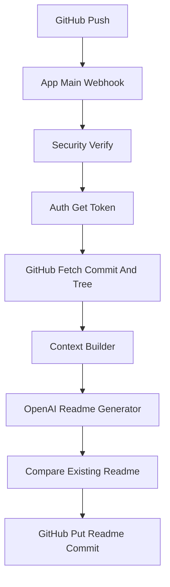

# Auto-README Bot

A GitHub App webhook server that generates and commits a README.md (including a Mermaid architecture diagram) whenever a push is made to a repository the app is installed on. The service verifies the webhook, builds a token budgeted repo context, uses the OpenAI API to synthesize a README, and commits the result only when it differs from the repository README.

## Features
- Runs as a GitHub App and responds to push events.
- Verifies webhook signatures with HMAC SHA256.
- Generates a short lived App JWT and exchanges it for an installation token to call the GitHub API.
- Fetches commit and repository tree data (Git Trees and Contents API).
- Builds a concise repo context (file tree + selected key files) constrained by a tiktoken token budget.
- Calls the OpenAI API to generate README markdown with an architecture Mermaid diagram.
- Commits README updates via the GitHub Contents API only when generated content differs.
- Configurable ignore lists, budgets, and model via environment variables.

## Installation

1. Install Python dependencies:
```bash
pip install -r requirements.txt
```

2. Create and configure a GitHub App:
- Webhook URL: https://<your-deployed-url>/webhook
- Set a webhook secret and grant repository Contents read and write permission.
- Subscribe to Push events.
- Save the App ID and download the private key (.pem).
- Install the app on the target repositories.

3. Configure environment variables:
- Copy `.env.example` to `.env` and fill in required values, or set env vars directly.

Required environment variables referenced in app/config.py and other modules:
- GITHUB_APP_ID
- GITHUB_APP_PRIVATE_KEY (PEM content) or GITHUB_APP_PRIVATE_KEY_PATH
- GITHUB_WEBHOOK_SECRET
- OPENAI_API_KEY

Optional:
- OPENAI_MODEL (defaults to `gpt-5-mini`)

Config tunables (set via env or found in app/config.py):
- BOT_COMMIT_MARKER
- CONTEXT_BUDGET_TOKENS
- MAX_OUTPUT_TOKENS
- INCREMENTAL_CHANGE_RATIO_THRESHOLD
- MAX_TREE_ENTRIES_IN_PROMPT
- IGNORE lists (IGNORED_DIR_NAMES, IGNORED_EXTENSIONS, IGNORED_FILENAMES)

## Running locally
Start the FastAPI app with uvicorn:
```bash
uvicorn app.main:app --reload
```

- Health check: GET / returns {"status":"ok"}.
- Webhook endpoint: POST /webhook expects GitHub push events and the X-Hub-Signature-256 header.

## Deployment
- A Procfile and render.yaml are included for deployment to platforms like Render.
- .github/workflows/keep-alive.yml can optionally ping a RENDER_URL to keep a Render free tier instance warm.
- After deploying, update the GitHub App webhook URL to point to the deployed /webhook endpoint.

## Usage
- Push code to any repository where the GitHub App is installed.
- The bot processes pushes to the repository default branch and will:
  - Verify the webhook signature.
  - Ignore non push events, branch deletions, or pushes not on the default branch.
  - Skip pushes authored by the bot (checks commit message marker and author hints).
  - Build a repo context from the commit tree and selected files up to the token budget.
  - Call OpenAI to generate a README.
  - Compare generated README to the existing README and commit when different.

Commit marker and bot author hints are configured in app/config.py as BOT_COMMIT_MARKER and BOT_AUTHOR_NAME_HINTS.

## Project structure
- app/main.py — FastAPI app, /webhook endpoint, push orchestration and bot commit detection.
- app/auth.py — Generate App JWT and exchange for an installation token.
- app/security.py — HMAC SHA256 webhook signature verification.
- app/github_api.py — Git Trees and Contents API calls (get tree, get file content, get/put README, get commit).
- app/context_builder.py — File tree filtering, key file selection, token budget trimming using tiktoken.
- app/readme_generator.py — Builds prompts and calls the OpenAI API to create README markdown.
- app/config.py — Environment driven configuration: ignored files, budgets, model, commit marker.
- requirements.txt — Python dependencies.
- Procfile, render.yaml — deployment helpers.
- .github/workflows/keep-alive.yml — optional keep alive pinger for Render deployments.
- .env.example — example environment variables.

## Architecture diagram



Notes on flow:
- The Context Builder fetches a recursive repo tree then selects key files and trims their contents to a tiktoken budget before handing the context to the OpenAI Readme Generator.
- The OpenAI Readme Generator produces raw markdown only. The bot compares this to the current README and only uses the GitHub Contents API to create or update README.md when the content differs.

## Token and cost considerations
- CONTEXT_BUDGET_TOKENS controls how many model tokens of file contents are sent (measured with tiktoken).
- MAX_OUTPUT_TOKENS caps model output length.
- MAX_TREE_ENTRIES_IN_PROMPT limits how many file paths from the tree are included in the prompt.
- Default model is OPENAI_MODEL `gpt-5-mini` (override via env var).

## Testing
- Push a small commit to a repository where the GitHub App is installed and check logs and the repository for an updated README.md.