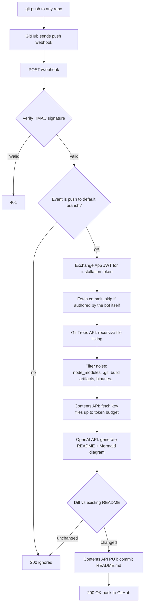

# Auto-README Bot

A GitHub App + webhook server that automatically generates and commits a
`README.md` (with a Mermaid architecture diagram) whenever you push to any
repository it's installed on — zero per-repo setup required.

## How it works



1. You push code to any repo you own.
2. GitHub fires a `push` webhook (the App is installed on "All repositories").
3. The server verifies the webhook signature, fetches the repo's file tree
   and key files via the GitHub API (no local git clone), sends that context
   to OpenAI, and gets back a full README with a Mermaid diagram reflecting
   the actual code structure.
4. If the generated README differs from what's there, it's committed back
   via the Contents API with the message `docs: auto-update README [bot]`.
   If it's unchanged, or the triggering commit was made by the bot itself,
   nothing happens.

## Project structure

- `app/main.py` — FastAPI app, `/webhook` endpoint, push-event orchestration
- `app/auth.py` — GitHub App JWT signing + installation token exchange
- `app/security.py` — HMAC-SHA256 webhook signature verification
- `app/github_api.py` — Git Trees / Contents API calls (fetch + commit)
- `app/context_builder.py` — file tree filtering, key-file selection, token-budgeted trimming (tiktoken)
- `app/readme_generator.py` — OpenAI prompt + call
- `app/config.py` — env vars and filtering config (ignored dirs/exts, budgets)

## Token efficiency

Kept deliberately cheap per run:

- Model defaults to `gpt-5-mini` — strong writing quality at a fraction of a
  full-size model's cost. Swap to `gpt-5-nano` for even less, or a bigger
  model for repos that need deeper reasoning.
- File contents sent to the model are capped by an actual **token** budget
  (measured with `tiktoken`, not a byte guess), so cost is predictable
  regardless of source language or encoding.
- The file tree in the prompt is capped separately (default 300 entries) so
  large monorepos don't balloon the prompt.
- Output is capped (`MAX_OUTPUT_TOKENS`) and the system prompt is kept short
  since it's resent on every single call.
- A no-op guard skips the commit (and none of this runs twice) whenever the
  generated README is unchanged from what's already there.

Tune all of this in `app/config.py`: `CONTEXT_BUDGET_TOKENS`,
`MAX_OUTPUT_TOKENS`, `MAX_TREE_ENTRIES_IN_PROMPT`.

## Setup

### 1. Install dependencies

```bash
pip install -r requirements.txt
```

### 2. Create and configure the GitHub App

1. GitHub Settings → Developer settings → GitHub Apps → New GitHub App.
2. Webhook URL: `https://<your-deployed-url>/webhook` (you can fill this in
   after deploying, then come back and update it).
3. Generate a webhook secret → this is `GITHUB_WEBHOOK_SECRET`.
4. Repository permissions → **Contents: Read and write**.
5. Subscribe to events → **Push**.
6. Save, note the **App ID**, generate and download a **private key** (.pem).
7. Install the app on your account, choosing **All repositories**.

### 3. Configure environment variables

Copy `.env.example` to `.env` and fill in:

- `GITHUB_APP_ID`
- `GITHUB_APP_PRIVATE_KEY` (PEM content) or `GITHUB_APP_PRIVATE_KEY_PATH`
- `GITHUB_WEBHOOK_SECRET`
- `OPENAI_API_KEY`
- `OPENAI_MODEL` (optional, defaults to `gpt-5-mini`)

### 4. Run locally

```bash
uvicorn app.main:app --reload
```

### 5. Deploy

Deploy to Render or Railway, set the env vars above in the platform's
dashboard, then update the GitHub App's Webhook URL to point at the deployed
`/webhook` endpoint. A `render.yaml` and `Procfile` are included.

### 6. Keep it awake (Render free tier only)

Render's free tier spins the service down after ~15 minutes idle; the next
request pays a cold-start penalty (30-50s), which can exceed GitHub's webhook
delivery timeout. `.github/workflows/keep-alive.yml` pings the health
endpoint every 10 minutes via GitHub Actions (free) to keep it warm:

1. In this repo's GitHub settings → Secrets and variables → Actions → New
   repository secret.
2. Name: `RENDER_URL`, value: your deployed URL (e.g.
   `https://auto-readme-bot.onrender.com`, no trailing slash).
3. That's it — the workflow runs on its own schedule. Not needed if you're
   on Railway or a paid Render plan.

## Testing

Push a small commit to any repo where the app is installed, then check your
deploy platform's logs and the repo for an updated `README.md`.
